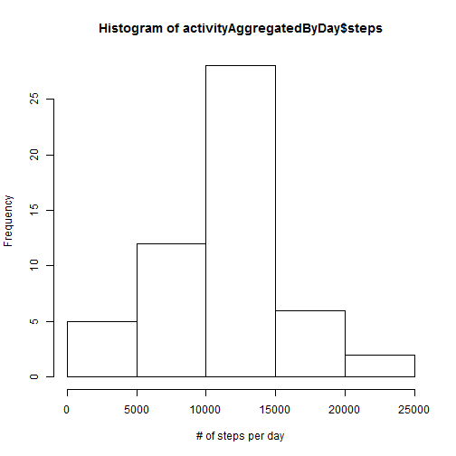
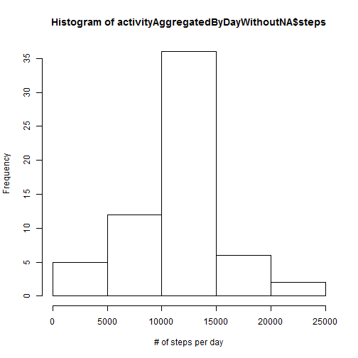
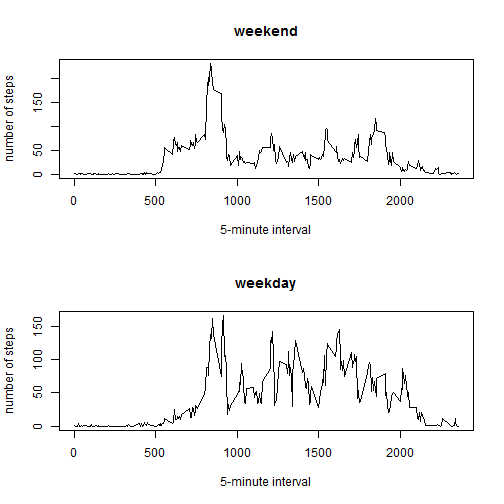

## Introduction

This assignment makes use of data from a personal activity monitoring
device. This device collects data at 5 minute intervals through out the
day. The data consists of two months of data from an anonymous
individual collected during the months of October and November, 2012
and include the number of steps taken in 5 minute intervals each day.

## Loading and preprocessing the data

- Load the data


```r
activity <- read.csv("activity.csv")
```

The variables included in this dataset are:

* **steps**: Number of steps taking in a 5-minute interval (missing
    values are coded as `NA`)

* **date**: The date on which the measurement was taken in YYYY-MM-DD
    format

* **interval**: Identifier for the 5-minute interval in which
    measurement was taken
    
The dataset contains **17568** observations.

Before further processing, we transform the Date entries to R dates

- Process/transform the data (if necessary) into a format suitable for our analysis


```r
activity$date <- as.Date(activity$date)
```

## What is mean total number of steps taken per day?

In order to be able to calculate and report the mean and median, we first need to aggregate the 5-minute intervals per day.

The missing value are **not** removed at this stage.


```r
activityAggregatedByDay <- aggregate(steps~date, data=activity, sum, na.rm=TRUE)
```

- Make a histogram of the total number of steps taken each day


```r
hist(activityAggregatedByDay$steps, xlab="# of steps per day")
```

 

- Calculate and report the mean and median total number of steps taken per day


```r
stepsMean <- mean(activityAggregatedByDay$steps)
stepsMedian <- median(activityAggregatedByDay$steps)
```

The mean of the total number of steps taken per day is **1.0766189 &times; 10<sup>4</sup>** steps.

The median of the total number of steps taken per day is **10765** steps.

## What is the average daily activity pattern?

- Make a time series plot (i.e. type = "l") of the 5-minute interval (x-axis) and the average number of steps taken, averaged across all days (y-axis)


```r
stepsInterval <- aggregate(steps~interval, data=activity, mean, na.rm=TRUE)
plot(steps~interval,data=stepsInterval,type="l")
```

 

- Which 5-minute interval, on average across all the days in the dataset, contains the maximum number of steps?


```r
intervalWithMaxSteps <- stepsInterval[which.max(stepsInterval$steps), ]$interval
```

The interval with the maximum number of steps is the number **835**

## Imputing missing values

Note that there are a number of days/intervals where there are missing values (coded as NA). The presence of missing days may introduce bias into some calculations or summaries of the data.

- Calculate and report the total number of missing values in the dataset


```r
missingValues <- sum(is.na(activity$steps))
```

The number of missing values in the dataset is **2304**

- Devise a strategy for filling in all of the missing values in the dataset. The strategy does not need to be sophisticated. For example, you could use the mean/median for that day, or the mean for that 5-minute interval, etc.

The strategy I chose is to replace the missing values with the mean for that 5-minute interval across all days. The mean value of steps taken per interval is already available in `stepsInterval`.


```r
activityWithoutNA <- activity 
for(i in 1:nrow(activityWithoutNA)){
    if(is.na(activityWithoutNA[i,]$steps)){
        activityWithoutNA[i,]$steps <- stepsInterval[stepsInterval$interval==activityWithoutNA[i,]$interval,]$steps
    }
}
```

- Create a new dataset that is equal to the original dataset but with the missing data filled in.

The `activityWithoutNA` data frame now contains the mean for the corresponding interval


```r
head(activityWithoutNA)
```

```
##       steps       date interval
## 1 1.7169811 2012-10-01        0
## 2 0.3396226 2012-10-01        5
## 3 0.1320755 2012-10-01       10
## 4 0.1509434 2012-10-01       15
## 5 0.0754717 2012-10-01       20
## 6 2.0943396 2012-10-01       25
```

- Make a histogram of the total number of steps taken each day and Calculate and report the mean and median total number of steps taken per day. What is the impact of imputing missing data on the estimates of the total daily number of steps? Do these values differ from the estimates from the first part of the assignment?


```r
activityAggregatedByDayWithoutNA <- aggregate(steps ~ date, data=activityWithoutNA, sum)
hist(activityAggregatedByDayWithoutNA$steps, xlab="# of steps per day")
```

 

```r
meanWithoutNA <- mean(activityAggregatedByDayWithoutNA$steps)
medianWithoutNA <- median(activityAggregatedByDayWithoutNA$steps)
```

The mean of total number of steps taken per day is **1.0766189 &times; 10<sup>4</sup>** and the median is **1.0766189 &times; 10<sup>4</sup>**

The impact is that the total daily number of steps per day and the median are higher, because we added some values that were previously NA. The median is equal to the mean, because we replaced the NAs with the mean and that value became the midpoint of our frequency distribution. The mean is exactly the same, because we replaced the NA values with the mean value for the corresponding interval and then divided by the full sample (not only by the sample with not NA values in the "step" variable)


## Are there differences in activity patterns between weekdays and weekends?

- Create a new factor variable in the dataset with two levels - "weekday" and "weekend" indicating whether a given date is a weekday or weekend day.


```r
activityWithoutNA$day=ifelse(weekdays(activityWithoutNA$date, abbr=TRUE) %in% c("Sat","Sun"), "weekend","weekday")
weekdays <- subset(activityWithoutNA, day=="weekday")
weekend <- subset(activityWithoutNA, day=="weekend")
```


- Make a panel plot containing a time series plot (i.e. type = "l") of the 5-minute interval (x-axis) and the average number of steps taken, averaged across all weekday days or weekend days (y-axis).


```r
weekdaysAggregated <- aggregate(weekdays$steps ~ weekdays$interval, data=weekdays,FUN=mean)
weekendAggregated <- aggregate(weekend$steps ~ weekend$interval, data=weekend, FUN=mean)

par(mfrow=c(2,1))
plot(weekdaysAggregated,type="l",main="weekend",xlab="5-minute interval",ylab="number of steps")
plot(weekendAggregated,type="l",main="weekday",xlab="5-minute interval",ylab="number of steps")
```

 
